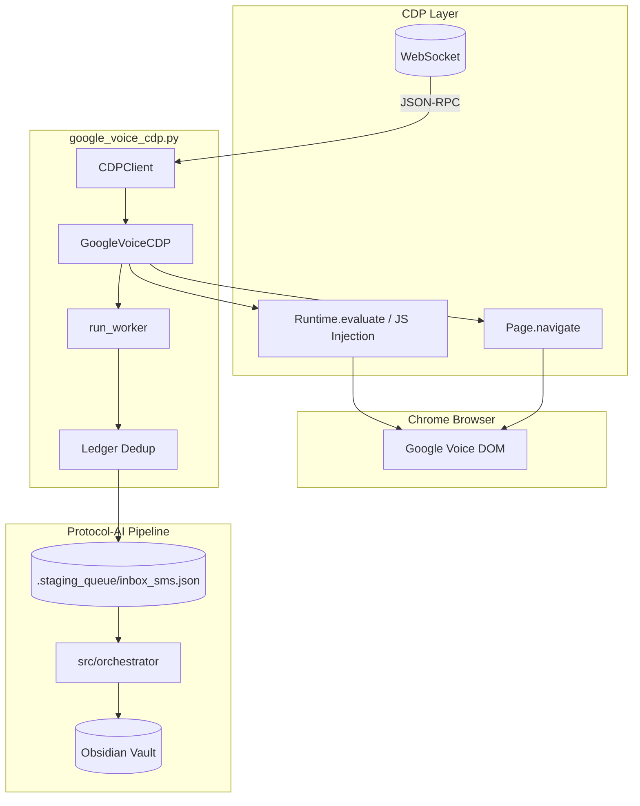
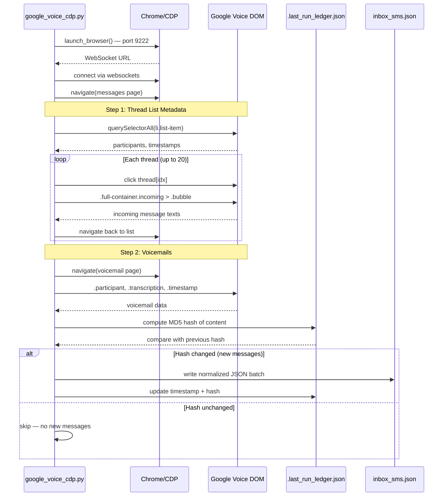
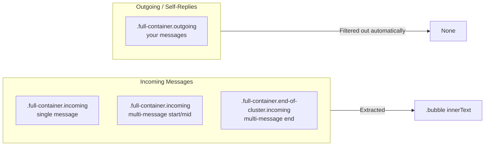
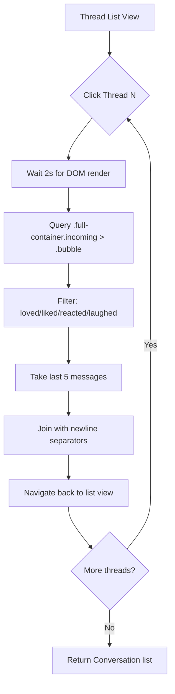
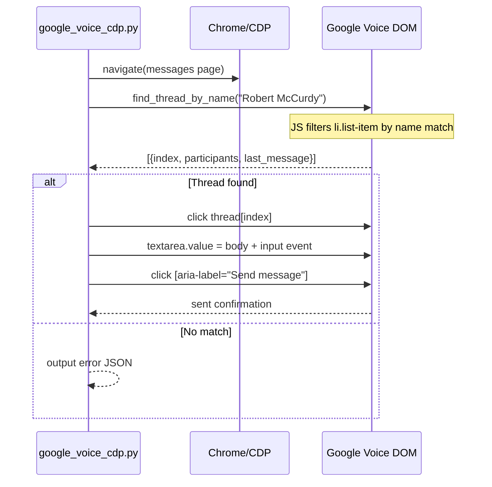
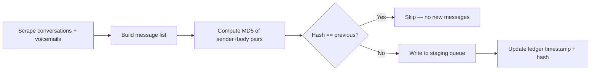
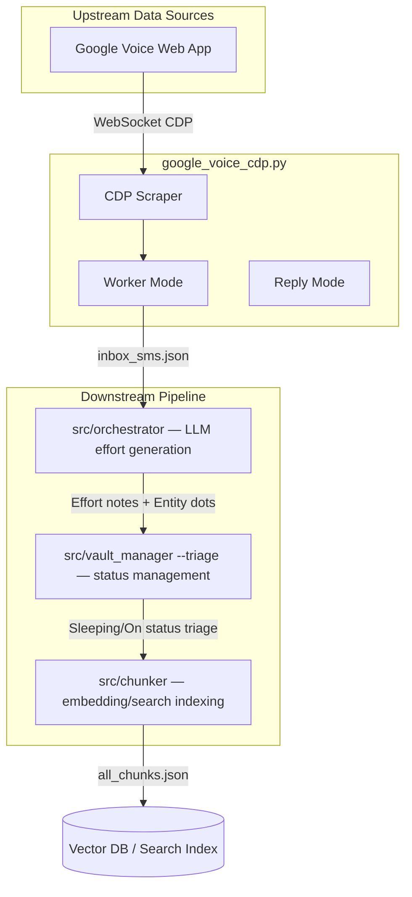

# Google Voice CDP Scraper — Design Document

## Overview

Headless Chrome DevTools Protocol (CDP) scraper that extracts SMS conversations and voicemails from [Google Voice](https://voice.google.com), normalizes them into the Protocol-AI staging pipeline, and optionally sends replies. No libraries — raw WebSocket + JSON-RPC only.

**Module:** `src/google_voice_cdp.py`  
**Modes:** Ingestion (default) | Reply-to-person | Manual-login

---

## Architecture



---

## Data Flow — Ingestion Mode (Default)



---

## DOM Parsing Strategy

### Thread List View (`/messages`)

Each conversation thread is an `<li class="list-item">` containing:

| Element | Selector | Purpose |
|---------|----------|---------|
| Participants | `gv-annotation.participants` | Comma-separated names (groups) or single name |
| Timestamp | text matching `/[apAP][mM]$/` | Relative time → ISO 8601 via `resolve_timestamp()` |
| Phone number | text matching `/\(?[0-9]{3}\)?/` | Caller ID for voicemails |

### Thread Detail View (after click)

Messages are `<div class="full-container">` elements with CSS classes:



**Key insight:** Using `.full-container.incoming` selector eliminates the need for "You:" prefix stripping — outgoing messages simply don't match.

### Voicemail View (`/voicemail`)

Each voicemail is an `<li class="list-item">` with:

| Element | Selector | Purpose |
|---------|----------|---------|
| Caller name | `.title .participant` | Name or phone number |
| Timestamp | `.thread-info-content-call-info .timestamp` | Relative time string |
| Transcription | `.subtitle .transcription` | AI-transcribed text body |
| Duration | `.duration` | Call length (e.g., `00:34`) |

---

## Multi-Message Context Extraction

Instead of a single snippet per thread, the scraper clicks into each thread and extracts up to **5 recent incoming messages**:



**Trade-off:** ~4 seconds per thread (2s click + 2s navigate back). For 8 threads = ~32 extra seconds, but provides rich conversational context for downstream LLM processing.

---

## Reply Mode (`--reply-to`)



---

## Deduplication via Ledger

The ledger (`Vault/.staging_queue/.last_run_ledger.json`) tracks:

| Field | Purpose |
|-------|---------|
| `google_voice` | ISO timestamp of last successful sync |
| `google_voice_hash` | MD5 hash of `(sender, body_plain)` tuples |

Hash is computed from **stable fields only** (excludes `iso_timestamp` which shifts on re-parsing). If content hasn't changed, the run exits early with "No new messages".



---

## Usage

### Default: Ingestion Worker

Scrapes Google Voice, deduplicates, writes normalized JSON to staging queue for the orchestrator pipeline.

```bash
python -m src.google_voice_cdp
# or from project root:
cd src && python google_voice_cdp.py
```

**Output:** `Vault/.staging_queue/inbox_sms.json` — batch of 18 messages (8 conversations + 10 voicemails) in gmail_worker-compatible format.

### Reply to a Person by Name

Resolves person name → thread index → sends message:

```bash
python -m src.google_voice_cdp --reply-to "Robert McCurdy" --body "Hello from CDP!"
```

### Manual Login Mode

Launches visible Chrome, waits 300 seconds for manual authentication, then proceeds with scrape:

```bash
python -m src.google_voice_cdp --no-headless
```

---

## Configuration

| Setting | Location | Value |
|---------|----------|-------|
| Browser path | `BROWSER_PATH` | `~/node/Chromium/Application/chrome.exe` |
| User data dir | `USER_DATA_DIR` | `src/Default_GV/` (excluded from git) |
| Debug port | CLI default | `9222` |
| Vault root | `VAULT_ROOT` | `C:/backup/ObsidianRoot` |
| Staging queue | `STAGING_DIR` | `Vault/.staging_queue/` |
| Log file | `LOG_FILE` | `src/gv_log.jsonl` (excluded from git) |

---

## Message Weight Classification

Messages are assigned `_filtered_weight` for downstream priority routing:

| Type | Weight | Tags |
|------|--------|------|
| SMS conversation | 85 | `["sms"]` |
| Voicemail | 95 | `["sms", "voicemail"]` |

Weights feed into the orchestrator's LLM prompt for effort generation and entity extraction.

---

## Filtering Rules (Applied at Two Layers)

### Layer 1: DOM Extraction (JS in browser)

- `.full-container.incoming` selector → incoming messages only
- Reaction filter: `loved`, `liked`, `reacted`, `laughed` prefixes
- Empty text filter: `length > 0`

### Layer 2: Python Worker (`run_worker`)

- Sender-name-as-body check: skips if message == sender name
- Unicode cleanup: strips directional formatting chars (`\u202a`, `\u202c`, `\u200b`)
- Dedup via ledger hash comparison

---

## Timestamp Resolution

`resolve_timestamp()` converts Google Voice relative times to ISO 8601 UTC:

| Input Format | Example | Resolved To |
|-------------|---------|-------------|
| `I:%M %p` | `5:12 PM` | Today's date + time |
| `a I:%M %p` | `Tue 5:29 PM` | Today's date + time |
| `b %-d, I:%M %p` | `Jun 3, 11:57 AM` | Current year + date + time |
| Fallback | parse failure | Current UTC timestamp |

---

## Integration Points



---

## Known Limitations & Edge Cases

1. **Thread ID gaps:** Google Voice doesn't expose stable thread IDs in the DOM — messages are keyed by snippet text
2. **Group participant count:** When no recent message exists, group threads show `"6"` as name and roster list as snippet (handled via `<gv-annotation>` fallback)
3. **Navigation timing:** 2-second delays between clicks prevent race conditions during page transitions
4. **Browser reuse:** If Chrome is already running on port 9222, the scraper reuses it instead of launching a new instance
5. **Syncthing locks:** Obsidian vault sync may be skipped if Syncthing holds file locks (graceful degradation)

---

## Changelog

| Date | Change | Commit |
|------|--------|--------|
| 2026-06-11 | Incoming-only selector + laugh filter | `e9eb6e3` |
| 2026-06-11 | Multi-message context (last 5/thread) | `2b6213e` |
| 2026-06-10 | Group participant resolution via `<gv-annotation>` | `2b6213e` |
| 2026-06-10 | Reacted notification filter added | `2b6213e` |
| 2026-06-10 | Initial CDP scraper implementation | `1c910c1` |
