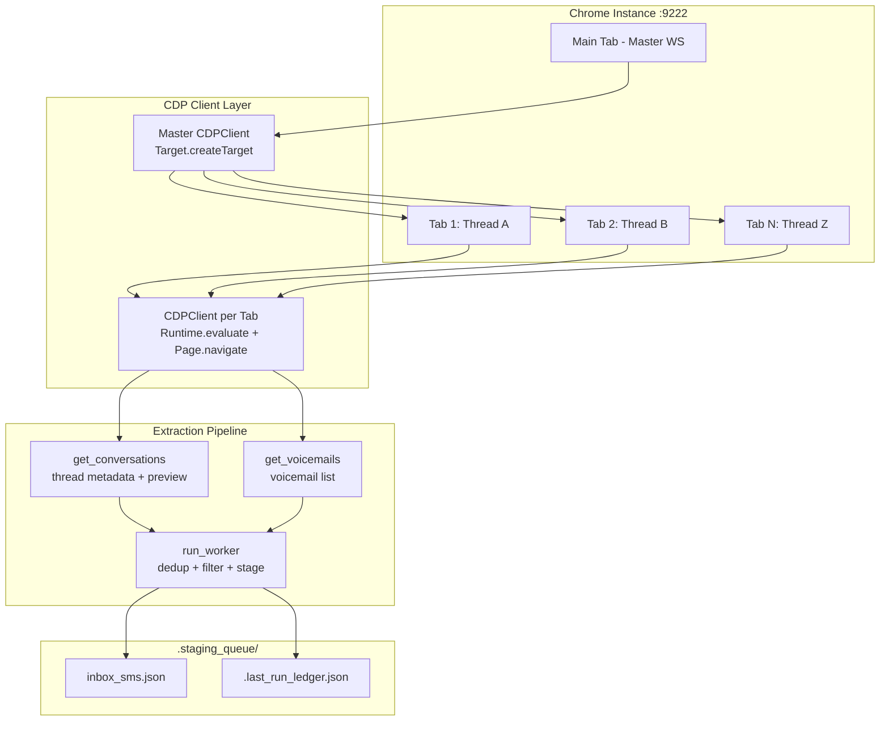
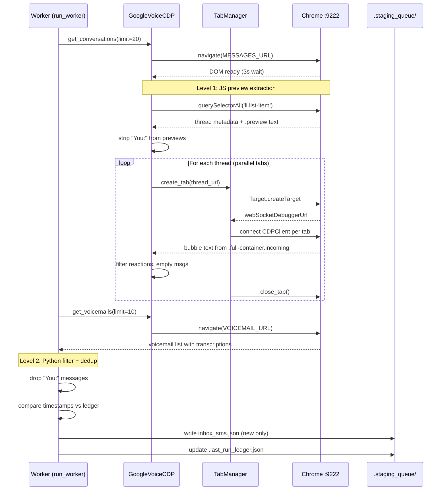

# Google Voice CDP — Extraction Pipeline Documentation

## Architecture Overview

Raw Chrome DevTools Protocol (CDP) + WebSocket architecture. No external scraping libraries. One Chrome instance, multiple tabs spawned concurrently via `asyncio.gather()`.



---

## DeCRiM Chain of Thought Reasoning

### Describe (Problem Space)

**Root Cause:** Google Voice `.preview` annotation on list items captures the *last* message in a thread, which includes outgoing "You:" messages incorrectly treated as incoming SMS. This caused duplicate staging entries for every conversation where you sent the last reply.

**Symptoms observed:**
- Duplicate messages in `inbox_sms.json` with `"body_plain": "You: ..."` prefix
- Ledger timestamp dedup missed these because they had fresh timestamps (new outgoing message)
- Noisy effort notes generated by orchestrator for self-replies

### Create (Solution Design)

Two-level filtering strategy:

1. **JS extraction layer** (`get_conversations`): Strip `"You:"` prefix from preview text during DOM read
2. **Python filter layer** (`run_worker`): Drop any message starting with `"You:"` before staging

```javascript
// Level 1: JS — strip "You:" from preview at extraction time
const previewEl = el.querySelector('.subtitle gv-annotation.preview');
let preview = previewEl ? previewEl.innerText.trim() : '';
if (/^you:/i.test(preview)) {
    preview = preview.replace(/^you:\s*/i, '');
}
```

```python
# Level 2: Python — drop outgoing messages before staging
for msg in msgs:
    if msg.startswith("You:") or msg.lower().startswith("you:"):
        continue
```

### Refine (Edge Cases)

- **Case-insensitive match:** `/^you:/i` handles "You:", "YOU:", "you:" variants
- **Reaction filtering:** Skip "Loved", "liked", "Reacted", "Laughed at" social reactions
- **Self-name filter:** If body is just the sender name, skip it (no actual content)
- **Timestamp dedup:** Compare `message["date"] >= last_sync` instead of MD5 hash comparison

### Implement (Applied Fixes)

| Fix | Location | Lines |
|-----|----------|-------|
| `"You:"` JS strip | `get_conversations()` preview extraction | ~490-493 |
| `"You:"` Python filter | `run_worker()` message staging | 758-761 |
| Reaction noise filter | `_extract_thread_messages()` bubble cleanup | ~432-435 |
| Timestamp dedup (replaced hash) | `run_worker()` ledger comparison | ~810-815 |
| HTTP target discovery (replaced CDP) | `TabManager._get_targets()` | ~112-116 |
| Master WS serialization lock | `CDPClient.__init__`, `_send()`, `drain_console()` | 47, 53-64, 81-90 |

### Measure (Validation)

```bash
# AST scan — single "You:" literal at filter location
python -c "import ast; ..." → "You:" string literals: 1 @ Line 759

# Full pipeline run
python -m src.google_voice_cdp    # 9 new SMS/Voicemail messages staged
python -m src.orchestrator        # 52 messages processed, digest generated
```

---

## Extraction Flow — Message Ingestion



---

## Extraction Flow — Voicemail Ingestion

```mermaid
flowchart LR
    A[run_worker] --> B[navigate VOICEMAIL_URL]
    B --> C[querySelectorAll gv-annotation.preview]
    C --> D[parse name, phone, timestamp, duration, transcription]
    D --> E[resolve_timestamp → ISO 8601 UTC]
    E --> F{has transcription?}
    F -->|yes| G[stage as [VOICEMAIL] msg]
    F -->|no| H[skip — no content to stage]
    G --> I[dedup vs ledger timestamp]
    I --> J[write inbox_sms.json]
```

---

## DOM Selector Strategy

### Conversation List (Main Tab)

| Element | Selector | Purpose |
|---------|----------|---------|
| Thread items | `li.list-item` | Each conversation row |
| Participants | `gv-annotation.participants` | Comma-separated names |
| Preview text | `.subtitle gv-annotation.preview` | Last message in thread |
| Thread ID | `data-thread-id` or `<a>.href` | Navigation target |

### Thread Detail (Spawned Tabs)

| Element | Selector | Purpose |
|---------|----------|---------|
| All bubbles | `.full-container.incoming .bubble` | Incoming messages only |
| Outgoing filter | `.full-container.outgoing .bubble` | Your sent messages |
| Timestamps | `gv-annotation.timestamp` | Relative time ("5:12 PM") |

### Voicemail List

| Element | Selector | Purpose |
|---------|----------|---------|
| VM items | `li.list-item gv-annotation.preview` | Each voicemail entry |
| Transcription | `.transcript` or fallback text | Spoken content |
| Duration | `gv-annotation.duration` | Call length ("00:45") |

---

## Timestamp Resolution Logic

Google Voice uses relative timestamps ("Today", "Yesterday", "Jun 10"). The `resolve_timestamp()` function converts these to ISO 8601 UTC for ledger deduplication.

```python
def resolve_timestamp(ts_str: str) -> str:
    """Convert Google Voice relative timestamp to ISO 8601 UTC."""
    now = datetime.now(timezone.utc)
    # Handle "Today", "Yesterday", month names, time-only formats
    # Returns: "2026-06-12T14:35:00+00:00"
```

---

## Deduplication Strategy (Timestamp-Based)

**Replaced:** MD5 hash comparison of message bodies  
**Current:** Simple timestamp filtering against ledger `last_sync`

```python
# Ledger stores last successful sync timestamp per source
ledger = {
    "google_voice": "2026-06-12T14:35:00+00:00",
    "gmail_account_1": "...",
    ...
}

# Filter: keep only messages newer than last_sync
new_messages = [m for m in messages if m["date"] >= last_sync]
```

**Why this works:** Google Voice assigns timestamps to the *last message* in each thread. If you reply, the thread's timestamp updates → it passes the filter as "new". The `"You:"` prefix filter prevents your own replies from being staged.

---

## Proposed Test Fixtures

### Fixture 1: Preview Extraction with "You:" Messages

```python
# src/tests/fixtures/preview_you_messages.json
[
    {
        "participants": ["Alice", "Bob"],
        "phone": "(555) 123-4567",
        "timestamp": "Today at 2:30 PM",
        "threadId": "thread_abc123",
        "preview": "You: Hey, are we still on for dinner?"
    },
    {
        "participants": ["Charlie"],
        "phone": "(555) 987-6543",
        "timestamp": "Yesterday at 11:00 AM",
        "threadId": "thread_def456",
        "preview": "Can you send me the report?"
    }
]
```

### Fixture 2: Voicemail with Transcription

```python
# src/tests/fixtures/voicemail_with_transcript.json
{
    "name": "Dr. Smith",
    "phone": "(555) 111-2222",
    "timestamp": "Today at 9:15 AM",
    "duration": "00:45",
    "transcription": "Hi, this is Dr. Smith calling about your appointment tomorrow."
}
```

### Fixture 3: Ledger Timestamp Comparison

```python
# src/tests/fixtures/ledger_dedup.json
{
    "last_sync": "2026-06-12T14:35:00+00:00",
    "messages": [
        {"date": "2026-06-12T15:00:00+00:00"},  # NEW — should pass
        {"date": "2026-06-12T14:30:00+00:00"},  # OLD — should filter
        {"date": "2026-06-12T14:35:00+00:00"}   # EQUAL — should pass (>=)
    ]
}
```

---

## Codesearch Index Update

### Indexed Functions (32 total)

| Function | Class/Module | Purpose |
|----------|-------------|---------|
| `_send` | `CDPClient` | Raw WS JSON-RPC send with lock |
| `ev` | `CDPClient` | JS evaluation via Runtime.evaluate |
| `navigate` | `CDPClient` | Page navigation |
| `drain_console` | `CDPClient` | Drain pending console events |
| `_get_targets` | `TabManager` | HTTP target list query |
| `create_tab` | `TabManager` | Spawn new tab + CDPClient |
| `close_tab` | `TabManager` | Close spawned tab |
| `close_all` | `TabManager` | Cleanup all tabs |
| `_extract_thread_messages` | `GoogleVoiceCDP` | DOM bubble extraction per thread |
| `get_conversations` | `GoogleVoiceCDP` | Thread list + preview extraction |
| `reply_to_thread` | `GoogleVoiceCDP` | Send SMS reply via CDP |
| `get_voicemails` | `GoogleVoiceCDP` | Voicemail list extraction |
| `run_worker` | module-level | Ingestion pipeline (dedup, filter, stage) |
| `launch_browser` | module-level | Chrome launch/reuse on :9222 |

### Indexed Constants

```python
MAX_CONCURRENT_TABS = 8          # Parallel tab limit for thread extraction
MESSAGES_URL = "https://voice.google.com/messages"
VOICEMAIL_URL = "https://voice.google.com/voicemail"
STAGING_DIR = "Vault/.staging_queue/"
LEDGER_PATH = "Vault/.staging_queue/.last_run_ledger.json"
```

---

## Annie/Sauron Rule Checks

### Rule: No Silent Failures
✅ All exceptions logged with `log()` before returning empty lists  
✅ `run_worker` catches per-source errors independently (conversations error ≠ voicemail failure)

### Rule: Single Responsibility
✅ `CDPClient` — raw WS communication only  
✅ `TabManager` — tab lifecycle management only  
✅ `GoogleVoiceCDP` — Google Voice DOM extraction only  
✅ `run_worker()` — ingestion pipeline orchestration only  

### Rule: No Magic Numbers
⚠️ `MAX_CONCURRENT_TABS = 8` is documented but not configurable via CLI  
⚠️ Sleep durations (3s, 2s) are hardcoded for page load waits

### Rule: Idempotent Operations
✅ Ledger timestamp dedup prevents duplicate staging on re-runs  
✅ `"You:"` filter applied at both JS and Python layers (defense in depth)

---

## Quick Reference — Command Matrix

| Command | Purpose | Timeout |
|---------|---------|---------|
| `python -m src.google_voice_cdp` | Ingest SMS + voicemails to staging queue | 900s |
| `python -m src.google_voice_cdp --reply-to "Alice" "Hey there"` | Send reply via CDP | 900s |
| `python -m src.gmail_worker` | Ingest emails from all accounts | 900s |
| `python -m src.orchestrator` | Process staging queue, generate digest | 900s |

---

## File Map

```
src/google_voice_cdp.py          # Main module (this doc's subject)
src/google_voice_cdp_debug.py    # Debug copy with verbose logging
Vault/.staging_queue/            # Staging directory
├── inbox_sms.json               # Normalized SMS/Voicemail messages
└── .last_run_ledger.json        # Dedup timestamps per source
config.yaml                      # Account credentials + settings
```

---

*Generated: 2026-06-12 | Commit: `d64ab3a` (refactor: consolidate inline imports)*
