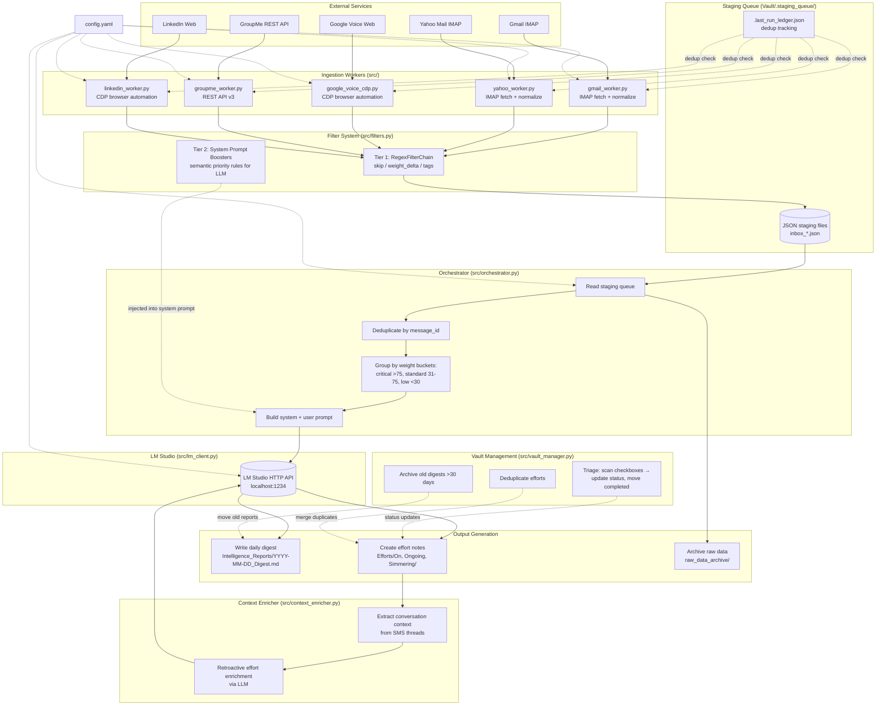
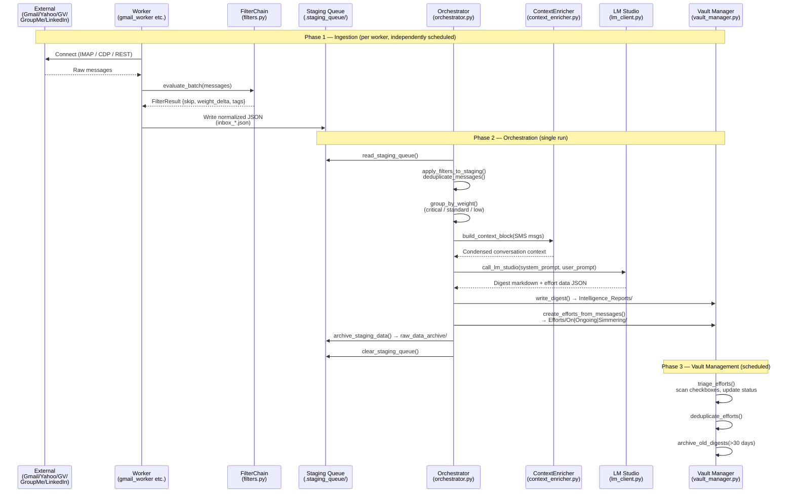
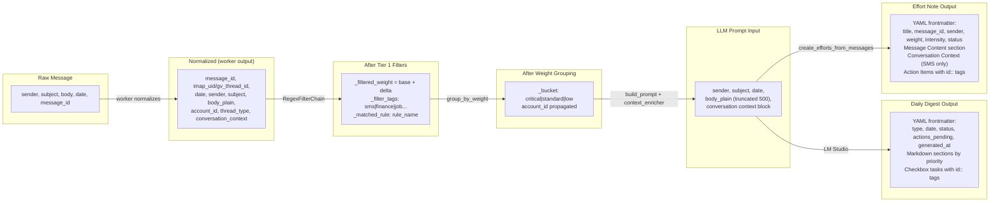
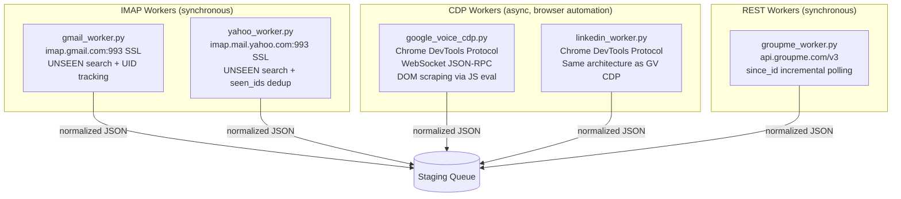
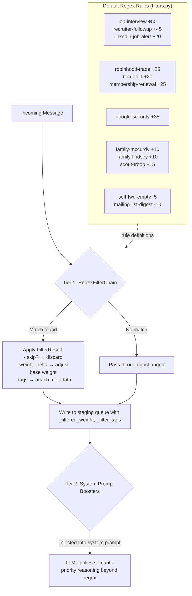
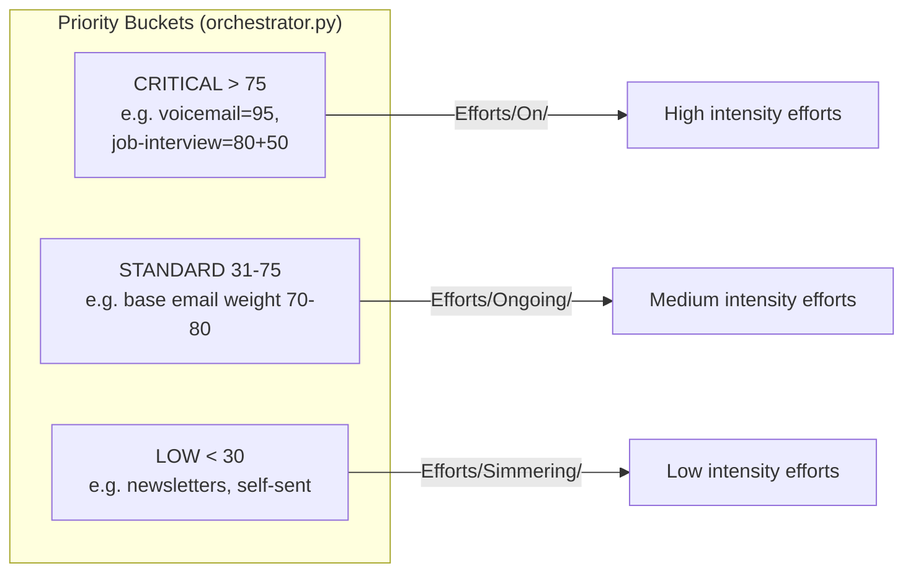
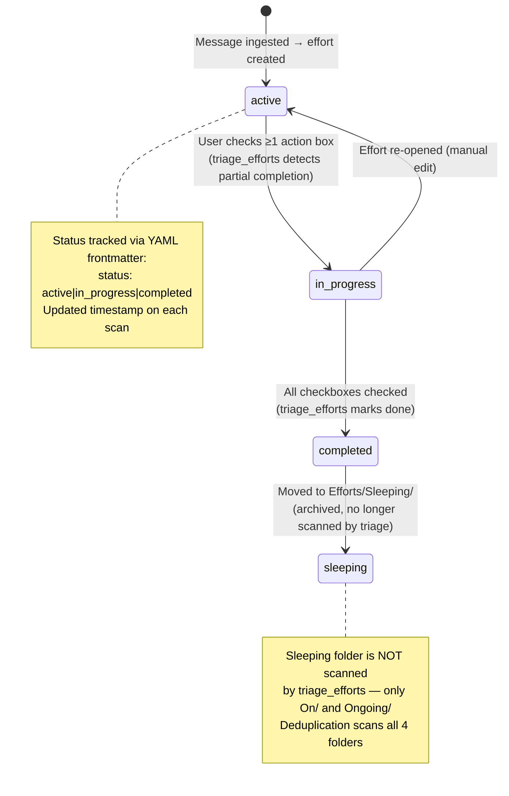
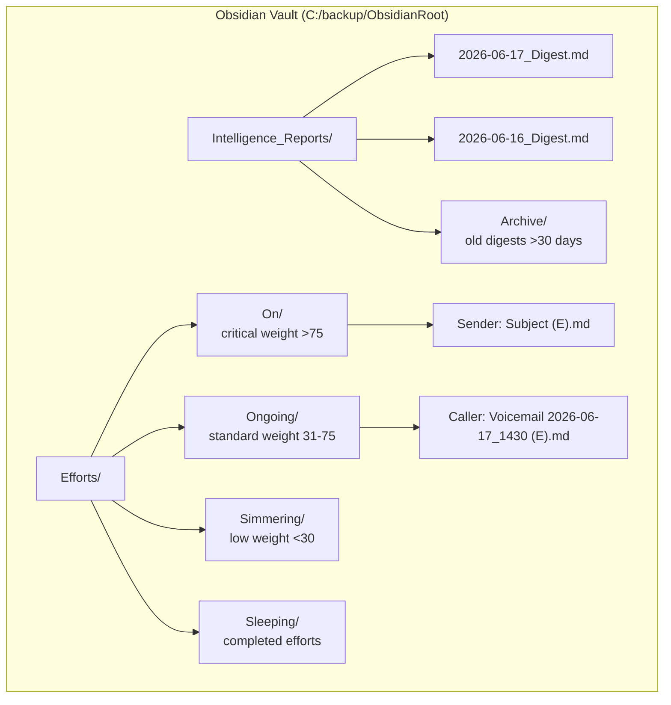

# Protocol-AI — Full Reconstruction Guide

> **Purpose:** A personal intelligence pipeline that ingests messages from Gmail, Yahoo Mail, Google Voice (SMS/voicemail), GroupMe, and LinkedIn; filters and prioritizes them via a two-tier filter system; sends compiled prompts to LM Studio for AI analysis; then writes structured Obsidian daily digests + effort notes with action items.

---

## Table of Contents
1. [Architecture Overview](#architecture-overview)
2. [System Architecture (Mermaid)](#system-architecture)
3. [Data Flow Pipeline](#data-flow-pipeline)
4. [Component Reference](#component-reference)
5. [Filter System](#filter-system)
6. [Effort Lifecycle](#effort-lifecycle)
7. [Configuration](#configuration)
8. [Reproduction Checklist](#reproduction-checklist)

---

## Architecture Overview

The project follows a **micro-worker + orchestrator** pattern:

| Layer | Components | Role |
|-------|-----------|------|
| **Ingestion Tier** | `gmail_worker.py`, `yahoo_worker.py`, `google_voice_cdp.py`, `groupme_worker.py`, `linkedin_worker.py` | Fetch raw messages from external services, normalize to a common JSON schema, write to staging queue |
| **Filter Tier** | `filters.py` | Two-tier filtering: (1) regex-based skip/weight/tag at ingestion time, (2) system-prompt boosters injected into LLM calls |
| **Orchestration Tier** | `orchestrator.py` | Read staging queue → deduplicate → group by priority weight → build prompt → call LM Studio → parse response → write digest + effort notes |
| **Enrichment Tier** | `context_enricher.py` | Extract conversation context from SMS threads, condense for LLM prompts, retroactively enrich existing effort notes |
| **Management Tier** | `vault_manager.py` | Triage effort statuses (checkbox tracking), archive old digests, deduplicate efforts |
| **Shared Infrastructure** | `lm_client.py`, `config.yaml` | LM Studio HTTP client, centralized config for all accounts/credentials/settings |

---

## System Architecture



---

## Data Flow Pipeline



---

## Component Reference

### Message Flow Through the System



### Worker-Specific Details



---

## Filter System

### Two-Tier Architecture



### Weight Bucket Classification



---

## Effort Lifecycle



### Effort File Structure (YAML Frontmatter)

```yaml
---
type: Protocol-AI-effort
title: "Sender Name: Subject Line"
created: 2026-06-17
updated: 2026-06-17
message_id: gv_direct_t.+15551234567
sender: Alice Smith
date: 2026-06-17T10:30:00-04:00
weight: 85
intensity: On
status: active
source_digest: 2026-06-17_Digest.md
tags:
  - effort/sms
---

## Message Content
Summary of the message or conversation flow...

## Conversation Context    ← only for SMS messages with thread history
You: Hey, are we still on for tomorrow?
Alice: Yes! Same time at the cafe.

## Action Items
- [ ] Confirm meeting with Alice `id:: gv_direct_t.+15551234567` | `status:: pending`
```

---

## Configuration

### config.yaml Structure

```yaml
# LM Studio settings (shared by orchestrator + context_enricher)
lm_studio:
  host: http://localhost:1234
  api_key: sk-lm-...
  model: qwen3.6-27b-uncensored-heretic-v2-native-mtp-preserved

# Obsidian vault settings
obsidian:
  vault_path: C:/backup/ObsidianRoot
  obsidian_sync_path: C:/backup/ObsidianRoot
  reports_dir: Intelligence_Reports

# Google Voice SMS settings
google_voice:
  context_depth: 3    # max messages per conversation context window

# GroupMe REST API settings
groupme:
  access_token: <token>
  groups:
    - id: 104914770
      label: GroupMe-104914770
      weight: 60
    - id: 115418781
      label: GroupMe-115418781
      weight: 60

# Account definitions (used by gmail_worker + yahoo_worker)
accounts:
  - category: comms
    email: freeload101@yahoo.com
    id: freeload101_yahoo
    label: freeload101_yahoo
    provider: yahoo
    weight: 80
    folders: [INBOX]
    app_password: <yahoo_app_password>

  - category: comms
    email: freeload101@gmail.com
    id: freeload101
    label: freeload101
    provider: gmail
    weight: 80
    folders: [INBOX]
    app_password: <gmail_app_password>

  - category: comms
    email: rmccurdywork@gmail.com
    id: rmccurdywork
    label: rmccurdywork
    provider: gmail
    weight: 70
    folders: [INBOX]
    app_password: <gmail_app_password>

  - category: comms
    email: rmccurdyjob@gmail.com
    id: rmccurdyjob
    label: rmccurdyjob
    provider: gmail
    weight: 95
    folders: [INBOX]
    app_password: <gmail_app_password>
```

---

## Reproduction Checklist

### Directory Structure to Create

```
PROTOCAL-AI/
├── config.yaml                    # All credentials + settings (see above)
├── requirements.txt               # Python dependencies
├── src/
│   ├── __init__.py                # empty, makes src a package
│   ├── orchestrator.py            # Main orchestration pipeline (~360 lines)
│   ├── vault_manager.py           # Effort lifecycle management (~280 lines)
│   ├── gmail_worker.py            # Gmail IMAP ingestion (~180 lines)
│   ├── yahoo_worker.py            # Yahoo Mail IMAP ingestion (~200 lines)
│   ├── google_voice_cdp.py        # Google Voice CDP browser automation (~350 lines)
│   ├── groupme_worker.py          # GroupMe REST API ingestion (~180 lines)
│   ├── linkedin_worker.py         # LinkedIn CDP browser automation (~320 lines)
│   ├── filters.py                 # Two-tier filter system (~160 lines)
│   ├── context_enricher.py        # SMS conversation context enrichment (~200 lines)
│   └── lm_client.py               # LM Studio HTTP client (~45 lines)
├── Vault/
│   ├── .staging_queue/            # JSON staging files (inbox_*.json)
│   │   ├── inbox_freeload101.json
│   │   ├── inbox_rmccurdywork.json
│   │   ├── inbox_rmccurdyjob.json
│   │   ├── inbox_freeload101_yahoo.json
│   │   ├── inbox_sms.json         # Google Voice messages
│   │   ├── inbox_groupme.json     # GroupMe messages
│   │   ├── inbox_linkedin.json    # LinkedIn items
│   │   └── .last_run_ledger.json  # Dedup tracking (shared by IMAP workers)
│   ├── Intelligence_Reports/      # Daily digest markdown files
│   │   ├── 2026-06-17_Digest.md
│   │   └── Archive/               # Old digests (>30 days)
│   ├── Efforts/                   # Action item notes
│   │   ├── On/                    # Critical priority (weight > 75)
│   │   ├── Ongoing/               # Standard priority (weight 31-75)
│   │   ├── Simmering/             # Low priority (weight < 30)
│   │   └── Sleeping/              # Completed/archived efforts
│   └── raw_data_archive/          # Archived staging data for RAG/vector storage
└── src/Default_GV/                # Chrome user profile (for CDP workers)
```

### Python Dependencies (`requirements.txt`)

```txt
pyyaml>=6.0
requests>=2.31
websockets>=12.0
```

> **Note:** `imaplib`, `email`, `json`, `asyncio` are all stdlib — no extra installs needed.

### Key Design Decisions to Reproduce

1. **All timestamps use Eastern Time** (`America/New_York`) via `zoneinfo.ZoneInfo` — never UTC for display
2. **Message deduplication**: IMAP workers use UID/seen_ids tracking; CDP workers use date-based cutoff from ledger timestamp
3. **Two-tier filtering**: Tier 1 (regex) runs at ingestion time in Python; Tier 2 (semantic boosters) is injected into the LLM system prompt
4. **Effort deduplication**: Scans ALL effort folders for existing `message_id` before creating new files — prevents duplicate efforts across intensity levels
5. **CDP workers** (`google_voice_cdp.py`, `linkedin_worker.py`) use raw WebSocket JSON-RPC — no Selenium/Playwright, just `websockets` + JS eval via Chrome DevTools Protocol
6. **LM Studio call**: temperature=0, max_tokens=65536, single system+user message pair
7. **Digest output**: YAML frontmatter with programmatically injected `generated_at` timestamp (never trust LLM for timestamps)
8. **Effort notes**: Always inject `message_id` programmatically — never AI-generated (safety guard against hallucination)

### Command-Line Usage

```bash
# Phase 1: Ingestion (run workers independently, any order)
python src/gmail_worker.py                    # all Gmail accounts
python src/gmail_worker.py --account rmccurdyjob  # single account only
python src/yahoo_worker.py                    # all Yahoo accounts
python -m src.google_voice_cdp                # Google Voice SMS + voicemail (headless Chrome)
python -m src.groupme_worker                  # GroupMe REST API
python -m src.linkedin_worker                 # LinkedIn CDP browser automation

# Phase 2: Orchestration (single run after all workers complete)
python src/orchestrator.py                    # full pipeline: read → filter → LLM → digest + efforts
python src/orchestrator.py --dry-run          # print prompt only, no LM call

# Phase 3: Vault Management (scheduled, e.g. daily cron/task scheduler)
python src/vault_manager.py --triage          # scan effort checkboxes, update statuses
python src/vault_manager.py --archive-digests # move old digests to Archive/
python src/vault_manager.py --deduplicate     # find and merge duplicate efforts
python src/vault_manager.py --cleanup         # triage + archive in one run
```

### Runtime Dependencies

| Dependency | Purpose |
|-----------|---------|
| **LM Studio** running on `localhost:1234` with model loaded | AI analysis of messages, digest generation, effort content |
| **Chrome/Chromium** at `%HOME%/node/Chromium/Application/chrome.exe` | CDP browser automation for Google Voice + LinkedIn |
| **Obsidian** (optional) | Target vault for digests and effort notes; killed before writes to avoid file locks |

---

## Vault Directory Structure (Output Side)



---

## Quick Reference — Key Functions by Module

| Module | Key Function | Purpose |
|--------|-------------|---------|
| `gmail_worker.py` | `process_account()` | IMAP fetch → filter → staging queue write |
| `yahoo_worker.py` | `process_account()` | Same pattern as Gmail, Yahoo IMAP server |
| `google_voice_cdp.py` | `run_worker()` | CDP scrape → normalize SMS/voicemail → staging queue |
| `groupme_worker.py` | `run_ingestion()` | REST API poll → filter → staging queue |
| `linkedin_worker.py` | `run_worker()` | CDP scrape posts/messages/notifs/invites → staging queue |
| `filters.py` | `RegexFilterChain.evaluate()` | Tier 1: regex match → skip/weight/tag |
| `filters.py` | `build_system_prompt_boosters()` | Tier 2: generate LLM prompt instructions |
| `orchestrator.py` | `read_staging_queue()` | Load all JSON staging files |
| `orchestrator.py` | `group_by_weight()` | Bucket messages into critical/standard/low |
| `orchestrator.py` | `build_prompt()` | Compile user prompt from grouped messages + SMS context |
| `orchestrator.py` | `create_efforts_from_messages()` | Generate effort notes with AI content or fallback template |
| `context_enricher.py` | `build_context_block()` | Condense SMS conversation history for LLM prompts |
| `context_enricher.py` | `enrich_effort_note()` | Retroactively update existing effort via LLM |
| `lm_client.py` | `call_lm_studio()` | HTTP POST to LM Studio OpenAI-compatible API |
| `vault_manager.py` | `triage_efforts()` | Scan checkboxes → update status → move completed to Sleeping |
| `vault_manager.py` | `deduplicate_efforts()` | Find and merge duplicate effort notes |

---

*Generated from source code analysis. All file paths, function signatures, and architectural decisions are extracted directly from the `src/` module.*
