# 🧜 Mermaid.js — Complete AI Skill Reference

Example PDF from Obsidian: [Mermaid.js Syntax and Diagram Guide.pdf](https://raw.githubusercontent.com/freeload101/Protocol-AI/refs/heads/main/SKILLS/Mermaid.js%20Syntax%20and%20Diagram%20Guide/Mermaid.js%20Syntax%20and%20Diagram%20Guide.pdf)

## General Structure

Every Mermaid diagram starts with a **diagram type declaration**. The code is wrapped in a fenced code block using ` ```mermaid ` in Markdown.

```markdown
```mermaid
<diagram-type>
    <diagram-content>
```
```

### Init Directive (Frontmatter Config)
Place at the **very first line** to configure theme/layout:
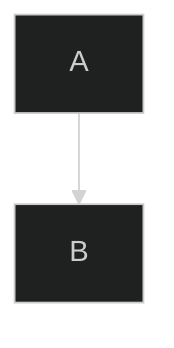

Or use YAML frontmatter (v10.5.0+):
```
---
config:
  theme: forest
  layout: elk
---
flowchart LR
    A --> B
```

---

## 1. Flowchart / Graph

### Direction Keywords
| Keyword | Direction |
|---|---|
| `TD` / `TB` | Top → Bottom |
| `LR` | Left → Right |
| `BT` | Bottom → Top |
| `RL` | Right → Left |

### Node Shapes

| Syntax | Shape |
|---|---|
| `A[text]` | Rectangle |
| `A(text)` | Rounded rectangle |
| `A([text])` | Stadium / pill |
| `A{text}` | Diamond (decision) |
| `A{{text}}` | Hexagon |
| `A((text))` | Circle |
| `A[/text/]` | Parallelogram (lean right) |
| `A[\text\]` | Parallelogram (lean left) |
| `A[/text\]` | Trapezoid |
| `A[\text/]` | Inverted trapezoid |
| `A>text]` | Asymmetric / flag |
| `A[(text)]` | Cylinder / database |
| `A@{ shape: rect }` | New v11.3+ shape syntax |

### v11.3+ Extended Shapes (selected)
| Short Name | Description |
|---|---|
| `diam` | Diamond |
| `cyl` / `db` | Cylinder/database |
| `doc` | Document |
| `docs` | Multi-document |
| `hex` | Hexagon |
| `stadium` / `pill` | Stadium |
| `fr-rect` / `subprocess` | Framed rectangle |
| `bolt` | Lightning bolt / com-link |
| `cloud` | Cloud |
| `hourglass` | Collate |
| `flag` | Paper tape |
| `cross-circ` | Summary |

### Arrow / Edge Types
| Syntax | Description |
|---|---|
| `-->` | Solid arrow |
| `-.->` | Dotted arrow |
| `==>` | Thick arrow |
| `---` | Solid line (no arrow) |
| `-.-` | Dotted line (no arrow) |
| `===` | Thick line (no arrow) |
| `-->|label|` | Arrow with label |
| `-- text -->` | Alternative label syntax |
| `--o` | Circle at end |
| `--x` | Cross at end |
| `<-->` | Bidirectional |

### Subgraphs
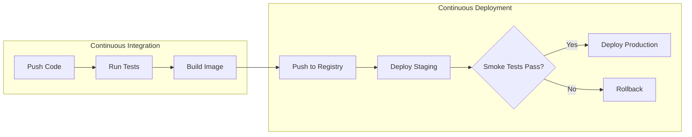

### Styling
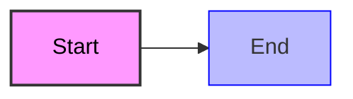

### Click Interactions


### Complex Flowchart Example
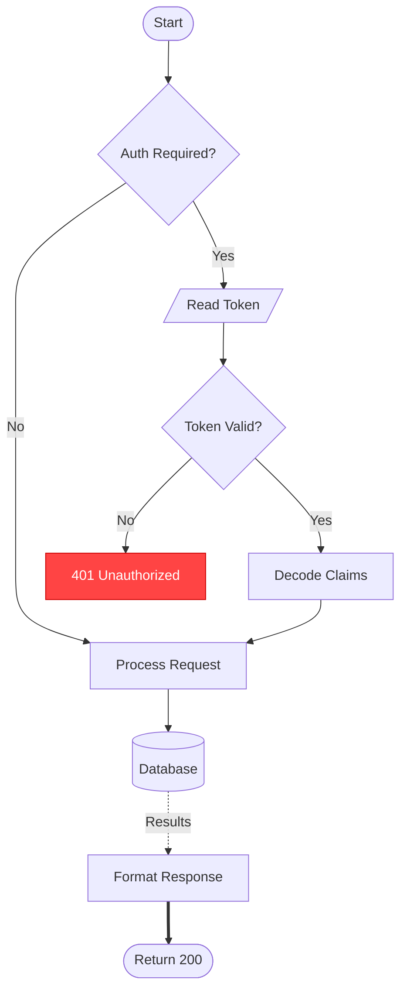

---

## 2. Sequence Diagram

### Participants & Actors
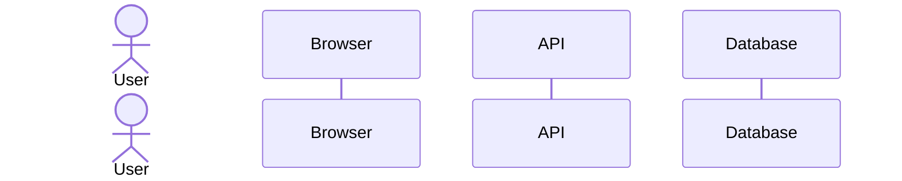
- `actor` → stick figure
- `participant` → box
- `as` → alias/display name

### Message Arrow Types
| Syntax | Description |
|---|---|
| `->` | Solid line, no arrowhead |
| `-->` | Dotted line, no arrowhead |
| `->>` | Solid line with arrowhead |
| `-->>` | Dotted line with arrowhead |
| `<<->>` | Bidirectional solid (v11.0.0+) |
| `<<-->>` | Bidirectional dotted (v11.0.0+) |
| `-x` | Solid with cross (lost message) |
| `--x` | Dotted with cross |
| `-)` | Solid open arrow (async) |
| `--)` | Dotted open arrow (async) |

### Activation Bars
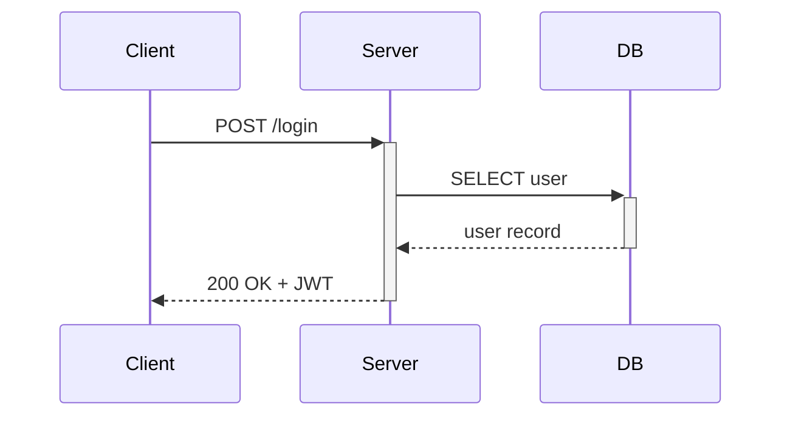
`+` activates, `-` deactivates.

### Control Flow Blocks
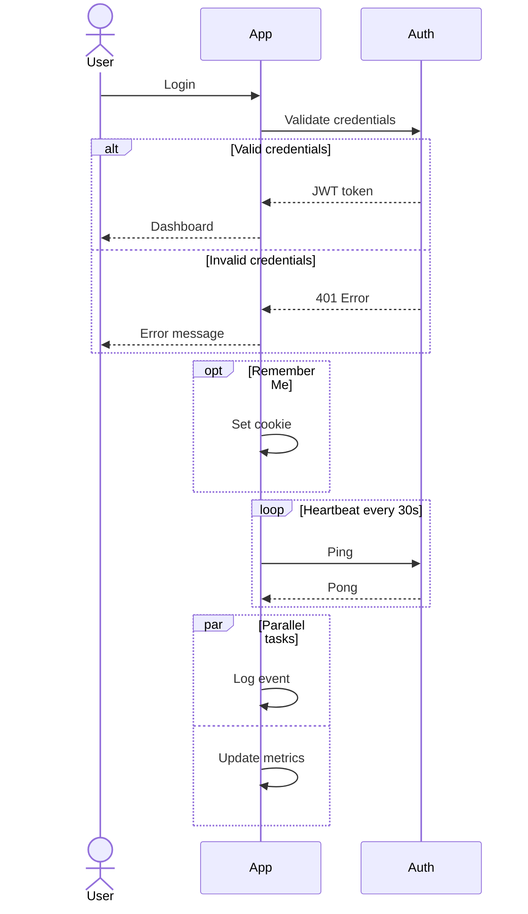

### Critical & Break
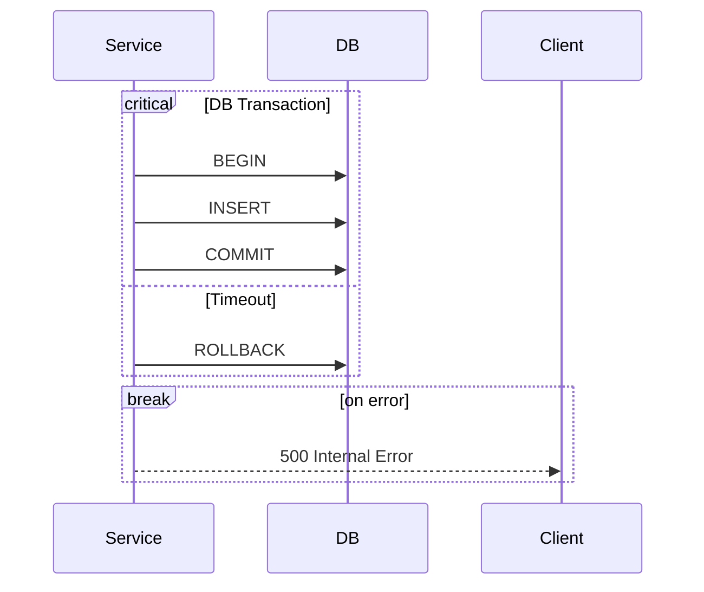

### Notes
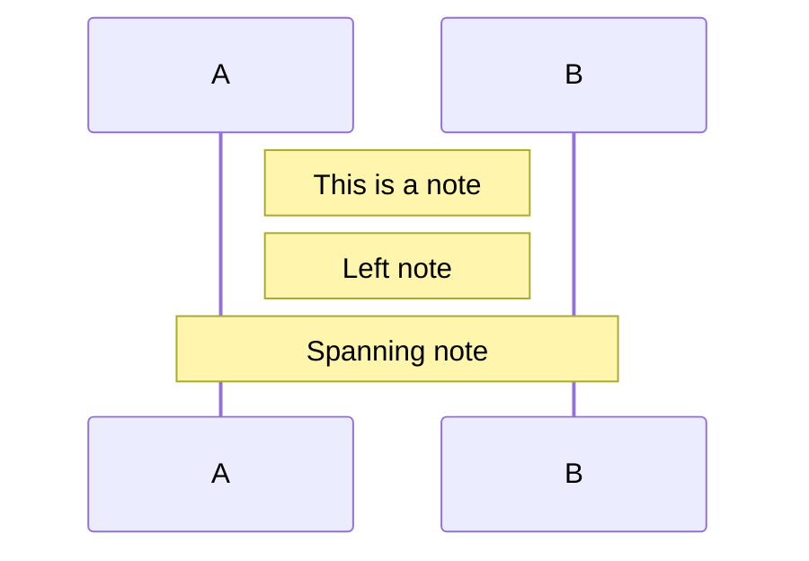

### Autonumber
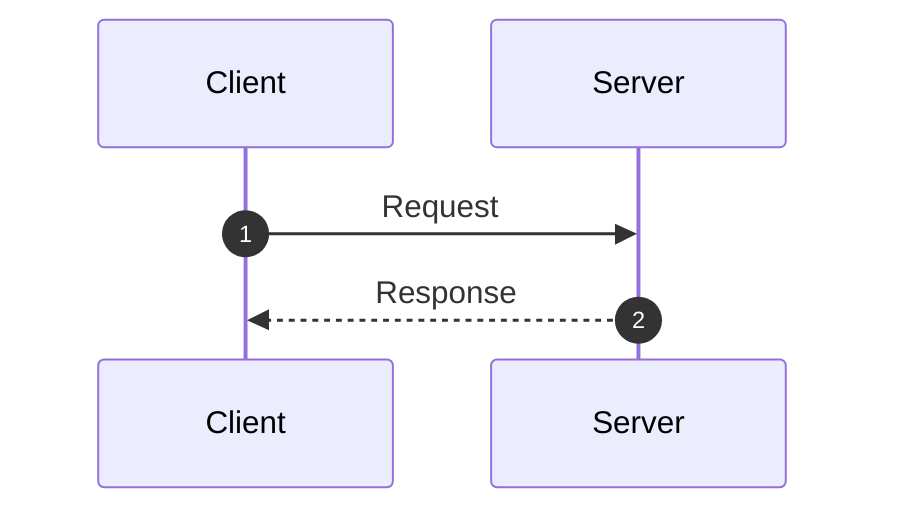

### Actor Groups / Boxes
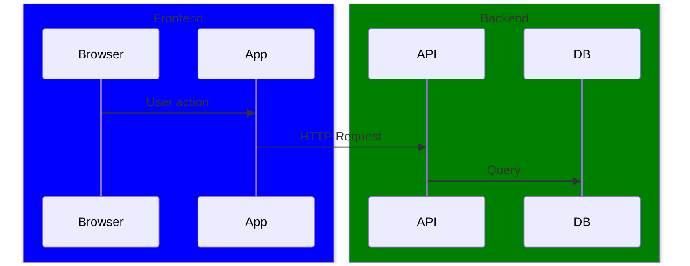

### Background Highlighting
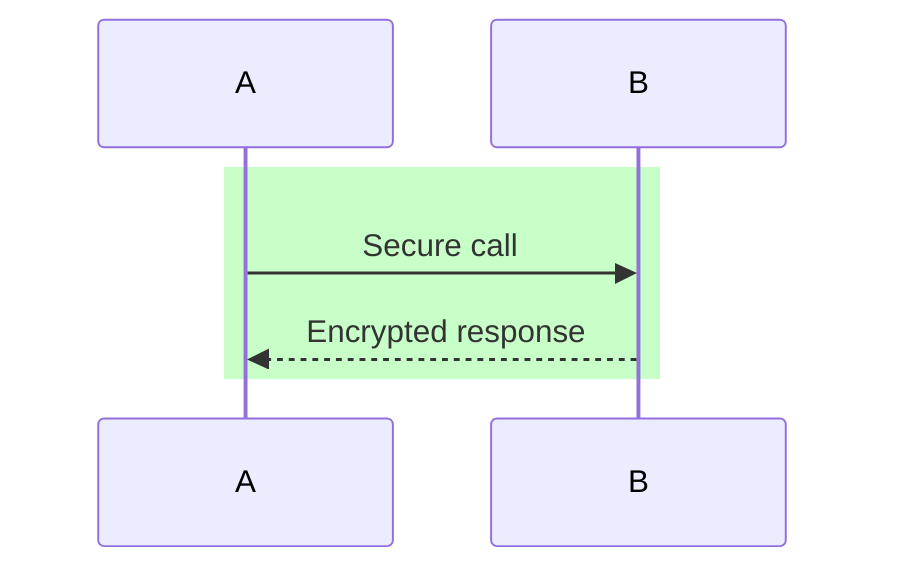

---

## 3. Class Diagram

### Visibility Markers
| Marker | Meaning |
|---|---|
| `+` | Public |
| `-` | Private |
| `#` | Protected |
| `~` | Package / internal |

### Class Syntax
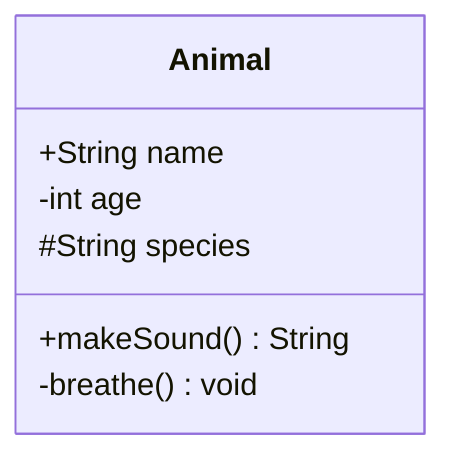

### Annotations
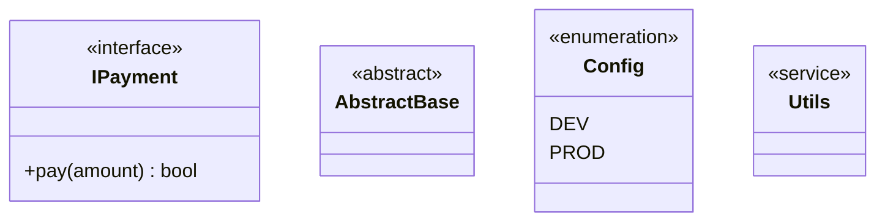

### Relationships
| Syntax | Relationship |
|---|---|
| `A <\|-- B` | B inherits A (extends) |
| `A *-- B` | Composition (A owns B) |
| `A o-- B` | Aggregation (A has B) |
| `A --> B` | Association (uses) |
| `A ..> B` | Dependency |
| `A ..\|> B` | Implementation (B implements A) |
| `A -- B` | Link (solid) |
| `A .. B` | Link (dotted) |

### Cardinality Labels
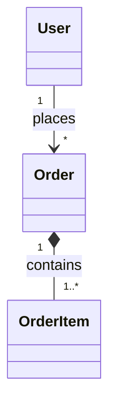

### Full E-Commerce Class Diagram Example
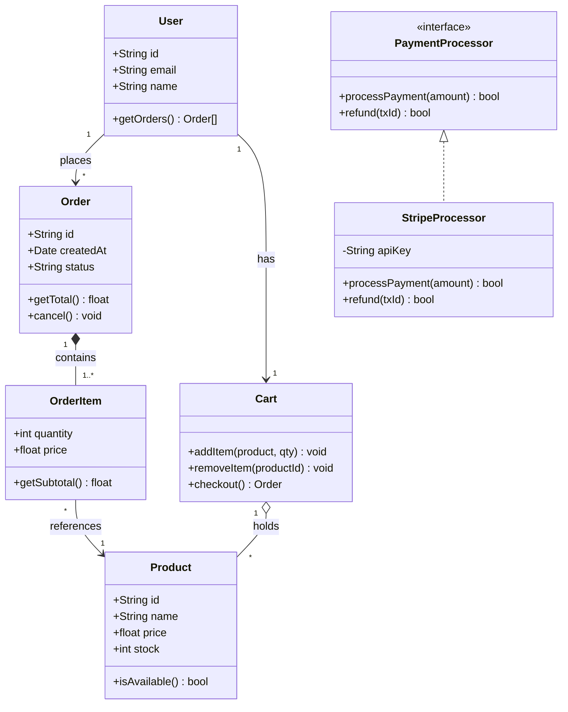

---

## 4. Entity-Relationship Diagram

### Attribute Markers
| Marker | Meaning |
|---|---|
| `PK` | Primary Key |
| `FK` | Foreign Key |
| `UK` | Unique Constraint |

### Cardinality Notation
| Syntax | Meaning |
|---|---|
| `\|\|--\|\|` | One to one |
| `\|\|--o{` | One to zero-or-many |
| `\|\|--\|{` | One to one-or-many |
| `}o--o{` | Zero-or-many to zero-or-many |
| `\|` | Exactly one |
| `o` | Zero |
| `{` | Many |

### Full Blog Schema Example
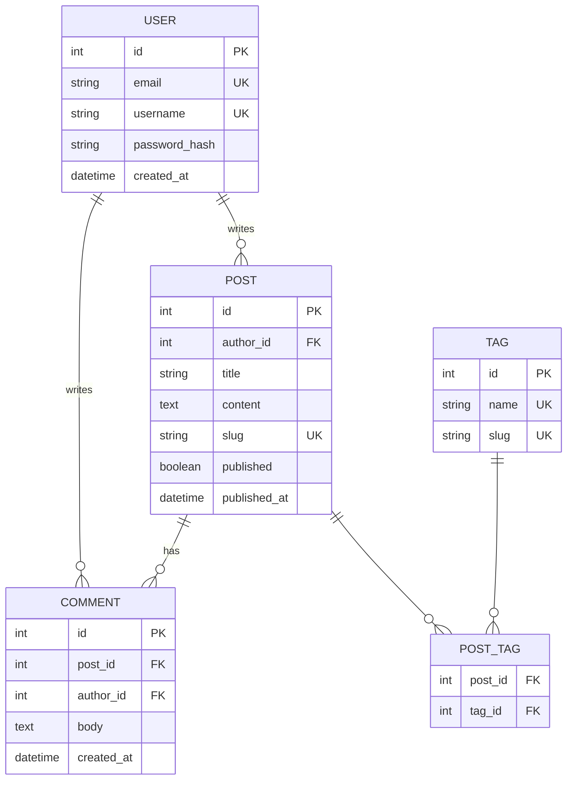

---

## 5. State Diagram (v2)

### Basic Syntax
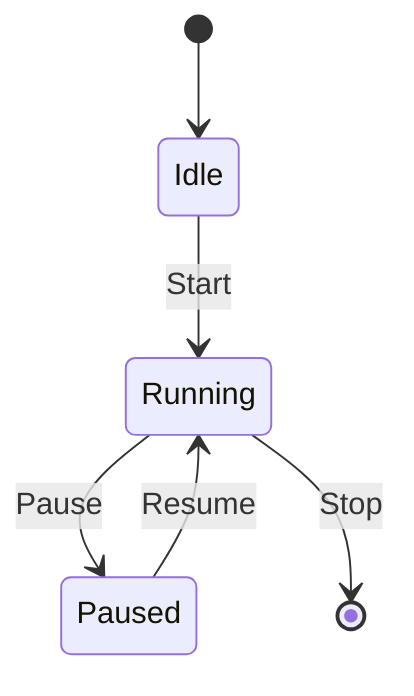

### State with Description
```mermaid
stateDiagram-v2
    state "Processing Payment" as PP
    [*] --> PP
    PP --> [*]
```

### Nested / Composite States
```mermaid
stateDiagram-v2
    [*] --> Authenticated
    state Authenticated {
        [*] --> Browsing
        Browsing --> Checkout : Add to Cart
        Checkout --> Paying : Confirm
        Paying --> [*]
    }
    Authenticated --> [*] : Logout
```

### Concurrency (Parallel States)
```mermaid
stateDiagram-v2
    [*] --> Active
    state Active {
        [*] --> Running
        --
        [*] --> Monitoring
    }
```

### Fork & Join
```mermaid
stateDiagram-v2
    state fork_state <<fork>>
    state join_state <<join>>
    [*] --> fork_state
    fork_state --> TaskA
    fork_state --> TaskB
    TaskA --> join_state
    TaskB --> join_state
    join_state --> [*]
```

### Notes in State Diagrams
```mermaid
stateDiagram-v2
    Idle --> Running
    note right of Idle
        System is waiting
        for user input
    end note
```

### Choice (Conditional)
```mermaid
stateDiagram-v2
    state check <<choice>>
    [*] --> check
    check --> Valid : input ok
    check --> Invalid : input error
    Valid --> [*]
    Invalid --> [*]
```

---

## 6. Gantt Chart

### Task Syntax
```
<task name> :<status,> <id,> <start>, <duration>
```
- Start: absolute `YYYY-MM-DD` or relative `after <id>`
- Duration: `Nd` (days), `Nw` (weeks), `Nh` (hours)

### Task Status Keywords
| Keyword | Effect |
|---|---|
| `done` | Completed (filled) |
| `active` | In progress (highlighted) |
| `crit` | Critical path (red) |
| `milestone` | Zero-duration marker |

### Full Project Timeline Example
```mermaid
gantt
    title Product Launch Timeline
    dateFormat YYYY-MM-DD
    excludes weekends

    section Planning
    Requirements       :done, req, 2026-04-01, 7d
    Technical Spec     :done, spec, after req, 5d
    Design Mockups     :done, des, after req, 5d

    section Development
    Core Features      :done, dev1, after spec, 21d
    API Integration    :active, dev2, after dev1, 14d
    Performance Tuning :dev3, after dev2, 7d

    section Testing
    Unit Tests         :test1, after dev1, 14d
    Integration Tests  :test2, after dev2, 7d
    UAT                :crit, test3, after dev3, 5d

    section Launch
    Beta Release       :milestone, m1, after test2, 0d
    Marketing Prep     :launch1, after m1, 10d
    Production Deploy  :crit, launch2, after test3, 2d
    Public Launch      :milestone, m2, after launch2, 0d
```

---

## 7. Git Graph

### Core Commands
| Command | Description |
|---|---|
| `commit` | Create a commit on current branch |
| `commit id:"name"` | Commit with custom label |
| `commit type: HIGHLIGHT` | Highlighted commit |
| `commit type: REVERSE` | Reversed/reverted commit |
| `commit type: NORMAL` | Standard commit (default) |
| `commit tag:"v1.0"` | Add tag to commit |
| `branch <name>` | Create a new branch |
| `checkout <name>` | Switch to branch |
| `merge <name>` | Merge branch into current |
| `cherry-pick id:"id"` | Cherry-pick a commit |

### Full Git Flow Example
```mermaid
gitGraph
    commit id: "init"
    branch develop
    checkout develop
    commit id: "setup"

    branch feature/auth
    checkout feature/auth
    commit id: "login-page"
    commit id: "jwt-impl"

    checkout develop
    merge feature/auth id: "merge-auth"

    branch feature/payments
    checkout feature/payments
    commit id: "stripe-init"
    commit id: "webhook-handler"
    commit type: HIGHLIGHT id: "payment-complete"

    checkout develop
    merge feature/payments

    checkout main
    merge develop tag: "v1.0.0"
    commit id: "hotfix" type: REVERSE
```

---

## 8. Pie Chart

```mermaid
pie title Browser Market Share 2026
    "Chrome"  : 65.2
    "Safari"  : 18.4
    "Firefox" : 7.1
    "Edge"    : 5.3
    "Other"   : 4.0
```

Use `showData` to display values:
```mermaid
pie showData
    title Traffic Sources
    "Organic" : 45
    "Direct"  : 25
    "Social"  : 20
    "Referral": 10
```

---

## 9. Mind Map

Indentation defines hierarchy. Root uses `((double parens))` for circle.

```mermaid
mindmap
    root((System Design))
        Frontend
            React App
            State Management
                Redux
                Context API
            Styling
                CSS Modules
                Tailwind
        Backend
            API Gateway
            Microservices
                Auth Service
                Payment Service
                Notification Service
            Database
                PostgreSQL
                Redis Cache
        DevOps
            CI/CD
                GitHub Actions
                ArgoCD
            Infrastructure
                Kubernetes
                Terraform
        Monitoring
            Metrics
                Prometheus
                Grafana
            Logging
                ELK Stack
```

Node shapes work the same as flowchart: `((circle))`, `[rect]`, `(rounded)`, `{{hexagon}}`

---

## 10. Timeline

```mermaid
timeline
    title Engineering Roadmap 2026
    section Q1
        Jan : MVP Launch
            : 1k users onboarded
        Feb : Payment system live
        Mar : Mobile app beta
    section Q2
        Apr : Enterprise tier
        May : API v2
            : Third-party integrations
        Jun : Series A funding
    section Q3
        Jul : Global CDN rollout
        Aug : SOC2 certification
```

---

## 11. C4 Diagram

### Types
- `C4Context` — System context
- `C4Container` — Container level
- `C4Component` — Component level
- `C4Dynamic` — Dynamic/sequence view

### Elements
| Element | Syntax |
|---|---|
| Person | `Person(alias, "label", "desc")` |
| External Person | `Person_Ext(alias, "label", "desc")` |
| System | `System(alias, "label", "desc")` |
| External System | `System_Ext(alias, "label", "desc")` |
| Container | `Container(alias, "label", "tech", "desc")` |
| Container DB | `ContainerDb(alias, "label", "tech", "desc")` |
| Component | `Component(alias, "label", "tech", "desc")` |
| Boundary | `System_Boundary(alias, "label") { ... }` |
| Relationship | `Rel(from, to, "label", "tech")` |

```mermaid
C4Context
    title System Context — Banking App

    Person(customer, "Customer", "A bank customer")
    Person_Ext(admin, "Admin", "Bank employee")

    System(bankApp, "Banking App", "Core banking system")
    System_Ext(email, "Email Service", "Sends notifications")
    System_Ext(sms, "SMS Gateway", "2FA codes")

    Rel(customer, bankApp, "Uses", "HTTPS")
    Rel(admin, bankApp, "Manages", "Internal")
    Rel(bankApp, email, "Sends emails", "SMTP")
    Rel(bankApp, sms, "Sends SMS", "REST API")
```

```mermaid
C4Container
    title Container View — Banking App

    Person(customer, "Customer")
    Container_Boundary(app, "Banking Application") {
        Container(spa, "Web App", "React", "User interface")
        Container(api, "API Server", "Node.js", "REST API")
        ContainerDb(db, "Database", "PostgreSQL", "User & transaction data")
        Container(cache, "Cache", "Redis", "Session storage")
    }
    System_Ext(stripe, "Stripe", "Payment processing")

    Rel(customer, spa, "Uses", "HTTPS")
    Rel(spa, api, "Calls", "REST/JSON")
    Rel(api, db, "Reads/Writes", "SQL")
    Rel(api, cache, "Reads/Writes", "Redis protocol")
    Rel(api, stripe, "Processes payments", "REST API")
```

---

## 12. Quadrant Chart

```mermaid
quadrantChart
    title Feature Priority Matrix
    x-axis Low Effort --> High Effort
    y-axis Low Impact --> High Impact
    quadrant-1 Quick Wins
    quadrant-2 Major Projects
    quadrant-3 Fill-ins
    quadrant-4 Thankless Tasks
    Dark Mode: [0.2, 0.8]
    API v2: [0.7, 0.9]
    Bug Fixes: [0.15, 0.4]
    Analytics Dashboard: [0.6, 0.7]
    Notifications: [0.35, 0.6]
    Legacy Migration: [0.85, 0.3]
```

---

## 13. Sankey Diagram

CSV format: `Source,Target,Value`

```mermaid
sankey-beta

Revenue,Product Sales,500000
Revenue,Services,200000
Revenue,Subscriptions,300000
Product Sales,COGS,300000
Product Sales,Gross Profit,200000
Services,Staff Costs,150000
Services,Profit,50000
Subscriptions,Infrastructure,80000
Subscriptions,Profit,220000
```

---

## 14. Architecture Diagram (beta)

```mermaid
architecture-beta
    group cloud(cloud)[AWS Cloud]
    group vpc(server)[VPC] in cloud

    service lb(internet)[Load Balancer] in vpc
    service api1(server)[API Server 1] in vpc
    service api2(server)[API Server 2] in vpc
    service db(database)[RDS Primary] in vpc
    service cache(database)[ElastiCache] in vpc
    service s3(disk)[S3 Bucket] in cloud

    lb:R --> L:api1
    lb:R --> L:api2
    api1:R --> L:db
    api2:R --> L:db
    api1:B --> T:cache
    api2:B --> T:cache
    api1:T --> B:s3
```

Service icons: `server`, `database`, `disk`, `internet`, `cloud`
Arrow syntax: `service1:Side --> Side:service2` (sides: `L`, `R`, `T`, `B`)

---

## 15. Block Diagram

```mermaid
block-beta
    columns 3
    A["Frontend"] B["API Gateway"] C["Backend"]
    block:services:3
        columns 3
        D["Auth"] E["Users"] F["Payments"]
    end
    G["Database"]:3
    A --> B
    B --> C
    C --> D
    C --> E
    C --> F
    D --> G
    E --> G
    F --> G
```

---

## 16. Kanban

```mermaid
kanban
    column Todo
        Task A@{ ticket: PROJ-1, priority: 'High' }
        Task B@{ ticket: PROJ-2, assigned: 'Alice' }
    column In Progress
        Task C@{ ticket: PROJ-3, assigned: 'Bob', priority: 'Very High' }
    column Review
        Task D@{ ticket: PROJ-4 }
    column Done
        Task E@{ ticket: PROJ-5, priority: 'Low' }
```

---

## 17. Theming

### Built-in Themes
| Theme | Description |
|---|---|
| `default` | Light, blue/purple |
| `dark` | Dark background |
| `forest` | Green palette |
| `neutral` | Grayscale |
| `base` | Bare — for full customization |

### Apply Theme
```mermaid
%%{init: {'theme': 'dark'}}%%
flowchart LR
    A --> B
```

### Full Custom Theme
```mermaid
%%{init: {
  'theme': 'base',
  'themeVariables': {
    'primaryColor': '#1e40af',
    'primaryTextColor': '#ffffff',
    'primaryBorderColor': '#1e3a8a',
    'lineColor': '#64748b',
    'secondaryColor': '#f1f5f9',
    'tertiaryColor': '#e2e8f0',
    'background': '#0f172a',
    'fontFamily': 'Inter, sans-serif',
    'fontSize': '14px',
    'edgeLabelBackground': '#1e293b',
    'clusterBkg': '#1e293b'
  }
}}%%
graph TD
    A[User] --> B[API]
    B --> C[(DB)]
```

---

## 18. Common Syntax Errors & Rules

### Critical Rules
- Node IDs **cannot contain spaces** — use `camelCase` or `snake_case`
- Node IDs must be **unique** within a diagram
- No **semicolons** in class diagram attributes
- **`sequenceDiagram`** uses `->>` not `->` for arrowhead messages
- **`stateDiagram-v2`** (use v2, not v1)
- **`gitGraph`** not `gitgraph` (capital G)
- Subgraph IDs must be unique; direction can be set: `subgraph id[Title]\n direction LR`
- Special characters in node labels: wrap in quotes `A["text with (parens)"]`
- Markdown strings (bold/italic in labels): use `A["\`**bold** text\`"]`

### Arrow Syntax Quick Checks
| Diagram | Correct | Wrong |
|---|---|---|
| Sequence request | `->>` | `->` |
| Sequence response | `-->>` | `-->` |
| Flowchart | `-->` | `->` |
| State transition | `-->` | `->` |
| Class relationship | `<\|--` | `<--` |

---

## 19. Quick Cheat Sheet

```
flowchart TD          sequenceDiagram       classDiagram
erDiagram             stateDiagram-v2       gantt
gitGraph              pie                   mindmap
timeline              C4Context             C4Container
C4Component           C4Dynamic             quadrantChart
sankey-beta           architecture-beta     block-beta
kanban
```

### Universal Init Config Template
```
%%{init: {
  'theme': 'default',
  'fontFamily': 'monospace',
  'flowchart': { 'curve': 'basis', 'padding': 20 },
  'sequence': { 'actorMargin': 50, 'showSequenceNumbers': true },
  'gantt': { 'axisFormat': '%m/%d' }
}}%%
```

---

> **Live Editor**: [mermaid.live](https://mermaid.live) — paste any diagram to preview instantly.
> **Official Docs**: [mermaid.js.org](https://mermaid.js.org)
> **Version**: This reference covers Mermaid v11.x <kcite></kcite><kcite></kcite><kcite></kcite>

---

## How to Use This as an AI Skill

Copy the entire reference above into a `SKILL.md` file (or your AI platform's skill/system prompt). When triggering the skill, the model should:

1. **Identify the diagram type** from the user's description
2. **Select the correct declaration keyword** (`flowchart`, `sequenceDiagram`, etc.)
3. **Apply valid syntax** using only the patterns in this reference
4. **Wrap output** in ` ```mermaid ` fenced code blocks
5. **Validate** against the common errors table before responding

---

